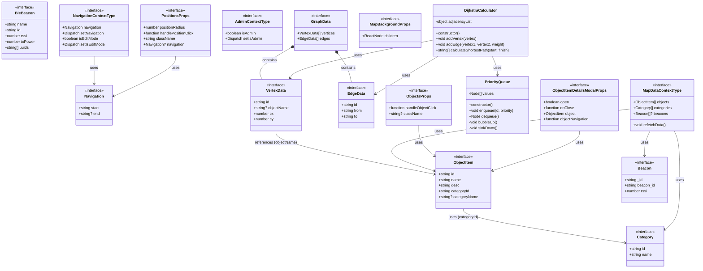

# FCITMap Class Diagram

## PlantUML Format

The class diagram is available in `class-diagram.puml`. You can view it using:
- [PlantUML Online Server](http://www.plantuml.com/plantuml/uml/)
- VS Code with PlantUML extension
- IntelliJ IDEA / WebStorm
- Any PlantUML-compatible tool

## Mermaid Format (Below)

## Class Summary

### Core Classes
- **PriorityQueue**: Implements a min-heap priority queue for Dijkstra's algorithm
- **DijkstraCalculator**: Implements Dijkstra's shortest path algorithm for navigation

### Core Interfaces
- **ObjectItem**: Represents a location/object on the map (e.g., bathroom, entrance)
- **Category**: Represents a category of objects (e.g., "Bathroom", "Entrance")
- **Beacon**: Represents a BLE beacon for indoor positioning
- **BleBeacon**: Extended beacon information with UUIDs and transmission power
- **Navigation**: Represents navigation state (start and end points)

### Graph Structures
- **VertexData**: Represents a vertex/node in the graph with coordinates
- **EdgeData**: Represents an edge/connection between vertices
- **GraphData**: Container for the complete graph structure

### Context Types (React Contexts)
- **NavigationContextType**: Manages navigation state and edit mode
- **MapDataContextType**: Manages map data (objects, categories, beacons)
- **AdminContextType**: Manages admin authentication state

### Component Props
- Various prop interfaces for React components (MapBackground, Objects, Positions, Modals, etc.)

